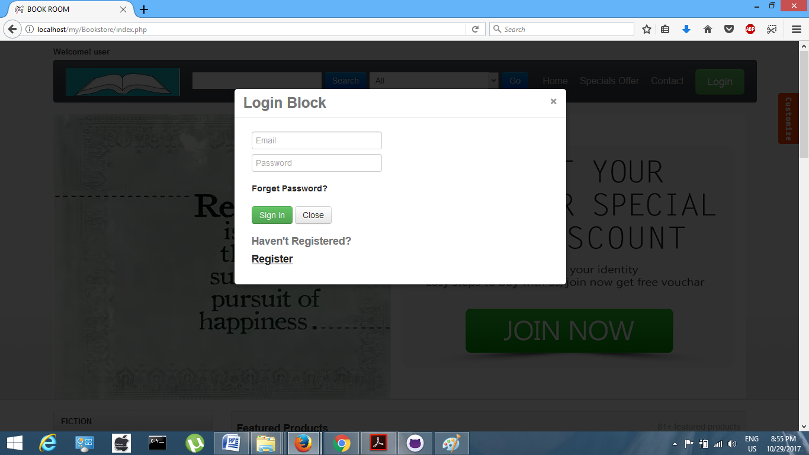
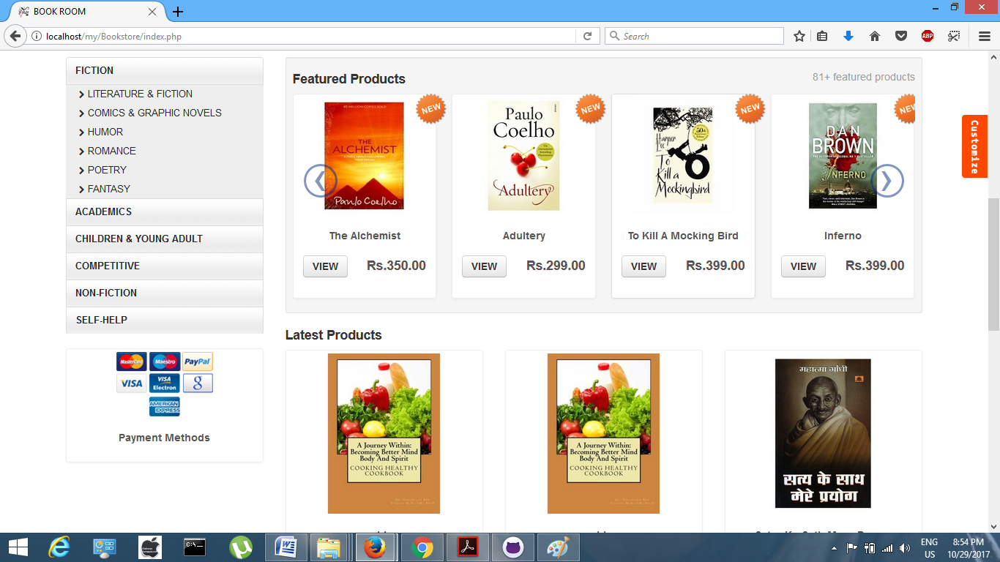
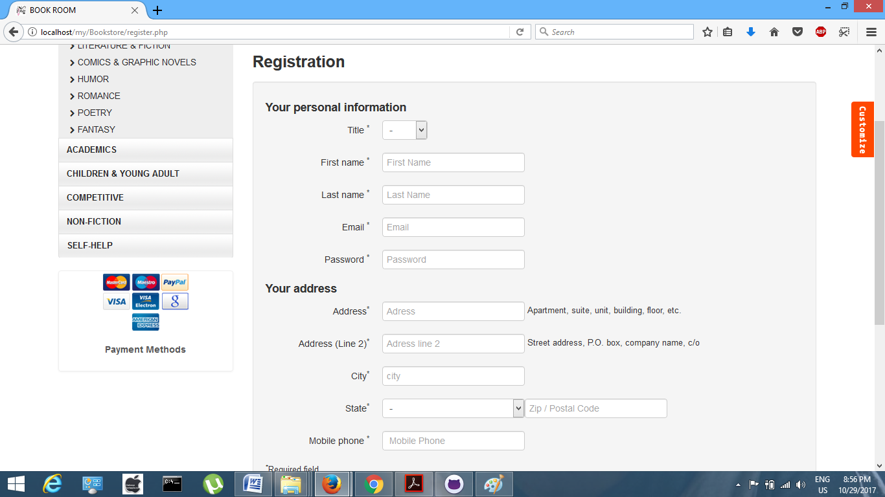
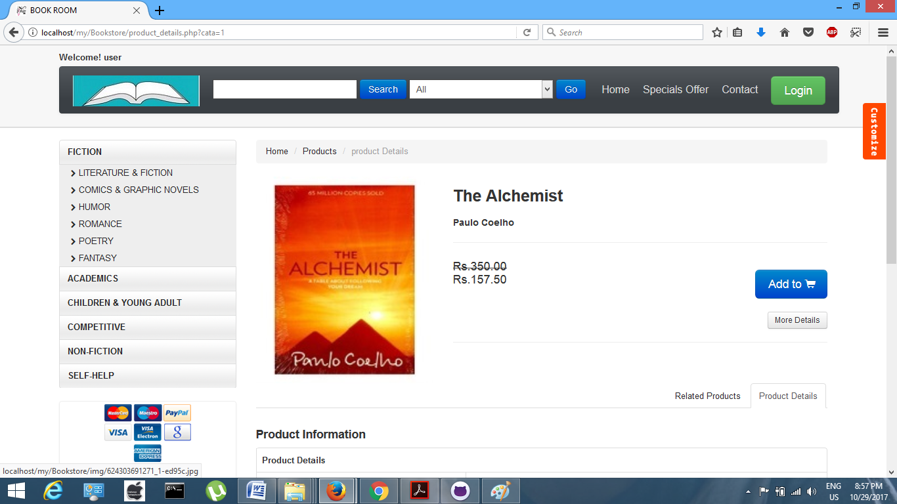
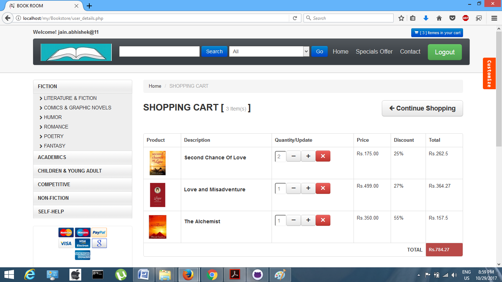
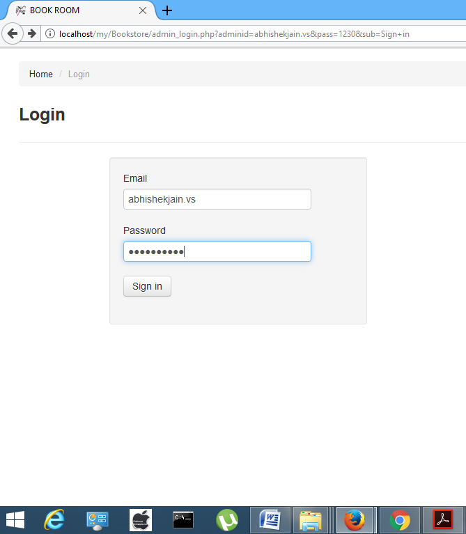
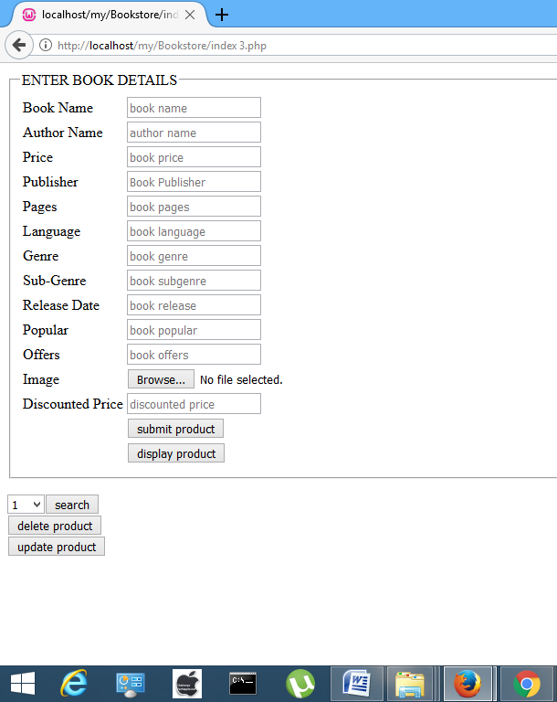

# Bookstore
Bookstore is an e-commerce website which deals with the buying and selling of books.

Running the application step by step-

A person can run this application by installing the web project "Bookstore" (attached). As webpage will run, it will not display the content and other info as the project is embeded with backhand. In order to create a backhand-

    Install WAMP/XAMPP.
    Start the admin and create a database 'ecommerce'.
    After that click on import and import a file 'ecommerce.sql' in the festhub folder. This will create a database.

After creating database successfully the result will be shown.

Technologies Used- 1)HTML 2)CSS 3)JAVASCRIPT 4)pHp.

<h2>SCREENSHOTS<h2>

 

 

 

 

 

 

